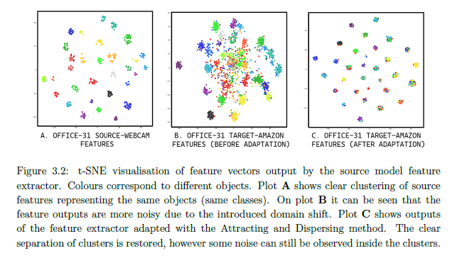
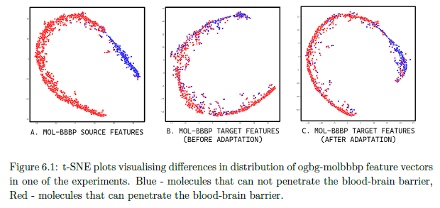

# Dissertation-Project
Source-Free Unsupervised Domain Adaptation for Image and Graph-Structured Data

Final year dissertation project submitted in fulfilment of the requirements for the degree of BSc in Computer Science in the University of Sheffield Department of Computer Science.

[Final_Dissertation.pdf](./Final_Dissertation.pdf) contains a full project report.

Experimental code consists of three folders:
- mol: files for running experiments on molecular graphs datasets
- ppa: files for running experiments on protein association neighbourhoods dataset
- visual: files for running experiments on image datasets

## Abstract
Unsupervised Domain Adaptation (UDA) aims to adjust a machine learning model trained
on data following one probability distribution to unlabeled dataset drawn from different
distribution. Source-Free Unsupervised Domain Adaptation (SFUDA) is a related problem
setting that additionally assumes that access to the original training set is restricted during
the adaptation process.
In recent years, various SFUDA strategies have been developed for computer vision or
natural language processing tasks. However, only a few techniques have been proposed for
graph-structured data.
To address this issue, the project first analyses the state-of-the-art image classification
SFUDA technique (Attracting and Dispersing), and next applies it to graph classification
SFUDA task. Several executed experiments show improvement of the graph classification
performance when the method is used.

## Project Stages
### I. Reproducing the State-of-the-Art Visual Source-Free Unupervised
In the first stage of the project, I reproduced experiments from the [Atttracting and Dispersing](https://sites.google.com/view/aad-sfda)(AaD) paper which, at the time of working on this project, declared the SOTA level performance on the commonly used image classification domain adaptation benchmarks. Experiments showed, that using the AaD method with ResNet-50 and ResNet-101 models improved their classification accuracy scores (in SFUDA setting) on the Office-31, Office-Home, and VisDA-C datasets by ~10.00%, ~25.00%, and ~35.00%
respectively. These results agreed with those declared by the authors of the original paper. The figure below presents example of changes in the distribution of features observed before and after application of the AaD method:

### II. Applying Attracting and Dispersing to Graph Source-Free Unsupervised Domain Adaptation
The second stage of the project aimed to evaluate usability of the AaD technique with selected graph neural network models (GCN and GIN) in the graph classification SFUDA setting. First, I downloaded the commonly used public graph classification benchmark datasets and preprocessed
them to create the SFUDA experimental scenarios similar to the ones defined for visual
experiments. Next, I modified the Open-Graph Benchmark (OGB) [repository](https://github.com/snap-stanford/ogb/tree/master/examples/graphproppred) of graph classification examples to make it compatible with the AaD framework and enable execution of my own experimental setting. Experiments showed classification accuracy gain of ~2.00% and ~4.00% on ogbg-molbbbp and ogbg-ppa respectively when the AaD was applied. 

